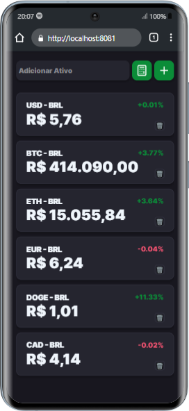

# FinTech Dashboard App

## Descrição

O **FinTech Dashboard App** é uma plataforma completa para exibir cotações de moedas, criptomoedas, e bonds (como ouro), com a possibilidade de realizar câmbio para BRL. A aplicação é projetada tanto para web quanto para mobile, fornecendo gráficos e indicadores detalhados para análise de variações de preço e desempenho de ativos ao longo do tempo.

## Funcionalidades

- **Cotações em tempo real** de moedas (USD, EUR, BRL, etc.), criptomoedas (Bitcoin, Ethereum, etc.), e bonds (Ouro).
- **Conversão para BRL**: Converta instantaneamente qualquer moeda ou ativo para o Real Brasileiro.
- **Gráficos interativos**: Visualize as tendências dos preços com gráficos de alta e baixa, comparações, e intervalos temporais ajustáveis.
- **Indicadores financeiros**: Exiba indicadores como volume de negociação, variação percentual, preço máximo/mínimo, e mais.
- **Alertas e notificações**: Configure alertas para ser notificado quando o preço atingir um valor desejado.
- **Interface intuitiva**: Design moderno e acessível, projetado para ser responsivo e amigável tanto em dispositivos móveis quanto na web.

## Tecnologias Utilizadas

- **Frontend**: React.js / React Native / Expo
- **Gráficos**: Chart.js / React Native Gifted Charts
- **API de Cotações**: Axios para busca de dados de [API financeiras](https://docs.awesomeapi.com.br/api-de-moedas)

